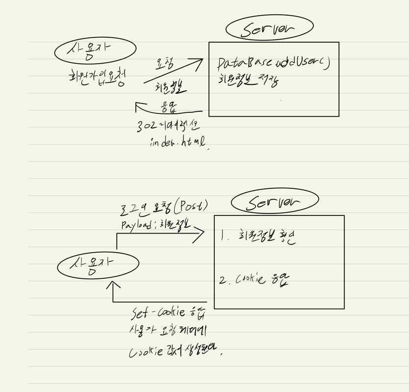
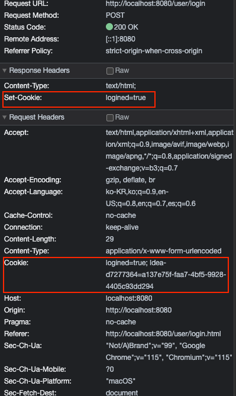

# 실습을 위한 개발 환경 세팅
* https://github.com/slipp/web-application-server 프로젝트를 자신의 계정으로 Fork한다. Github 우측 상단의 Fork 버튼을 클릭하면 자신의 계정으로 Fork된다.
* Fork한 프로젝트를 eclipse 또는 터미널에서 clone 한다.
* Fork한 프로젝트를 eclipse로 import한 후에 Maven 빌드 도구를 활용해 eclipse 프로젝트로 변환한다.(mvn eclipse:clean eclipse:eclipse)
* 빌드가 성공하면 반드시 refresh(fn + f5)를 실행해야 한다.

# 웹 서버 시작 및 테스트
* webserver.WebServer 는 사용자의 요청을 받아 RequestHandler에 작업을 위임하는 클래스이다.
* 사용자 요청에 대한 모든 처리는 RequestHandler 클래스의 run() 메서드가 담당한다.
* WebServer를 실행한 후 브라우저에서 http://localhost:8080으로 접속해 "Hello World" 메시지가 출력되는지 확인한다.

# 각 요구사항별 학습 내용 정리
* 구현 단계에서는 각 요구사항을 구현하는데 집중한다. 
* 구현을 완료한 후 구현 과정에서 새롭게 알게된 내용, 궁금한 내용을 기록한다.
* 각 요구사항을 구현하는 것이 중요한 것이 아니라 구현 과정을 통해 학습한 내용을 인식하는 것이 배움에 중요하다. 

# 요구사항 
### ServerSocket 에 관하여
* 실습에 들어가기 앞서 TCP/IP 통신에 대해서 알아야 한다.
  TCP/IP 통신은 소켓을 통한 통신으로 Server Socket 과 Client Socket이 존재한다.
* 서버 소켓은 서버프로그램에서 사용하는 소켓이다. 클라이언트의 연결 요청이 오는 것을 기다렸다가 연결 요청이 들어오면 연결을 한다.
* 클라이언트 소켓은 클라이언트 프로그램에서 서버 프로그램으로 연결 요청을 하고, 데이터 전송 역할을 한다.
* 서버 소켓 사용 방법
  ```
  ServerSocket server = new ServerSocket(포트번호);
  // 클라이언트로부터 연결 요청이 들어오면 연결을 맺고 클라이언트 소켓을 생성해서 리턴한다.
  Socket socket = server.accept();
  ```
* 클라이언트 소켓 사용 방법
  Socket socket = new Socket(서버 아이피, 서버 포트번호);

   > 참조 : https://juyoung-1008.tistory.com/19

### 요구사항 1 - http://localhost:8080/index.html로 접속시 응답


1. 요청을 하나씩 읽어야 한다. 요청은 다음과 같이 들어온다고 한다. hi.
   
     ``` http request
    GET /index.html HTTP/1.1
    Host: localhost:8080
    Connection: keep-alive
    Accept: */*
    ```
2. 이 요청은 webserver.RequestHandler 클래스의 run() 메소드에서 받는다.  
코드는 아래와 같다.
   ```java
   public void run() {
   	log.debug("New Client Connect! Connected IP : {}, Port : {}", connection.getInetAddress
   	connection.getPort());
   
   try (InputStream in = connection.getInputStream(); OutputStream out = connection.getOutputStream()) {
	      // TODO 사용자 요청에 대한 처리는 이 곳에 구현하면 된다.
	      DataOutputStream dos = new DataOutputStream(out);
	      byte[] body = "Hello World".getBytes();
	      response200Header(dos, body.length);
	      responseBody(dos, body);
   } catch (IOException e) {
       log.error(e.getMessage());
	}
   }
   ```
   
3. 이제 이 요청을 `BufferedReader` 로 읽어서 가져오면 된다. 그전에 `InputStreamReader` 로 `InputStream` 을 읽어야 한다.  
   * 간단하게 정리하면 `InputStream`은 아스키 코드로 데이터를 읽어온다. 이것을 문자로 변환해주는 것이  `InputStreamReader` 이다.  
   * 그런데 `InputStreamReader` 를 사용하려면 먼저 크기를 정해줘야 읽을 수 있다. 우리가 받을 데이터가 크기가 얼마일지 우리는 알기 쉽지 않다. 크기가 무한정일수도 있다.   
   * 이를 위해 `BufferedReader` 를 사용한다. `BufferedReader` 는 엔터를 치기 전까지 데이터를 읽어온다.  
   * [[Java] 콘솔 입력 - InputStream, BufferedReader, Scanner](https://makemethink.tistory.com/170)
   
4. 처음에 작성한 코드는 다음과 같다.
   ```java
   public void readHeader(InputStream is) throws IOException {
        InputStreamReader in = new InputStreamReader(is);
        BufferedReader br = new BufferedReader(in);
        String line = br.readLine();
        // url 자르는 용도
        String[] tokens = line.split(" ");
        while(!"".equals(line)){
            if (line == null) {
                return;
            }
           log.info("{}",line);
           line = br.readLine();
        }
    }
   ```
5. 아래의 toPath() 메소드는 Path 타입의 데이터를 리턴한다.

   File 객체는 하드디스크에 존재하는 실제 파일의 데이터가 들어가 있는게 아니고, 
   그것을 참조하는 경로를 추상화한 객체이다.

   ```java
   new File("./webapp" + url).toPath();
   ```
   파일의 경로를 받아왔으니 Files.readAllBytes을 사용해 파일을 읽어온다.
   그리고 읽어온 파일을 response의 header와 body에 넣는다.
   ```java
   byte[] body = Files.readAllBytes(new File("./webapp" + url).toPath());
   response200Header(dos, body.length);
   responseBody(dos, body);
   ```
   그러면 이제 아래와 같이 잘 나온다.
  
6. 위에서 /index.html 을 요청을 하면 css, js 등 여러 파일도 요청이 날라오게 된다.  
   이것은 index.html 안에 해당 파일을 읽어오는 href 와 같은 태그에 존재하기에  
   index.html이 로드될 때 해당 요청들이 생기는 것이다.
   
7. 해당 RequestHandler 클래스는 Thead를 확장(상속)한 것이다.  
   그렇기에 Thread 함수에 대해 알 필요가 있다.
   <details>
     <summary>Thread란?</summary>
     <div markdown="1">
      
     * 하나의 프로세스 내부에서 독립적으로 실행되는 하나의 작업단위
     * JVM에 의해 하나의 프로세스가 발생하고 main() 안의 실행들이 하나의 쓰레이다.
     * main() 이외의 또 다른 쓰레드를 만들려면 Thread 함수를 상속하거나 Runnable 인터페이스를 구현해야한다.
     * start() 메소드를 호출하면 run() 메소드에 설정된 스레드가  Runnable 상태로 진입한다.
   
     </div>
   </details>
8. RequestHandler 클래스에서 응답은  
   DataOutputStream dos = new DataOutputStream(out); 을 통해서 나간다.  
   그러므로 DataOutputStream 에 대해 알아보자.
* DataOutputStream 은 출력 스트림으로, 파일이나 콘솔에 데이터를 저장하거나 출력하는 역할을 한다.  
   여기 코드에서는 응답인 OutputStream out 에 데이터를 저장하는 일을 한다.  
   ```java
   DataOutputStream dos = new DataOutputStream(out);
   ```
* 저장을 한 뒤 flush() 를 사용하는데 이것은 남아있는 데이터를 보내는 것 같다.  
   다음 실행때 남아있는게 없기 위해 안전을 위해 써주는게 좋지만 안쓴다고 에러가 생기진 않더라.
9. ServerSocket 이란?  
   갑자기 ServerSocket 이 어디서 튀어나왔냐면 WebServer.java 에 있는 클래스이다.  
   ```java
   try (ServerSocket listenSocket = new ServerSocket(port)) {
            log.info("Web Application Server started {} port.", port);

            // 클라이언트가 연결될때까지 대기한다.
            Socket connection;
            while ((connection = listenSocket.accept()) != null) {
                RequestHandler requestHandler = new RequestHandler(connection);
                requestHandler.start();
            }
   }
   ```
* 소켓 연결은 네트워크로 연결된 두 대의 호스트간 통신을 위한 양 끝이라고 생각하면 된다.  
   즉, Connection을 개설하기 위한 도구이다.
* 클라이언트인 내가 소켓을 가지고 서버에 커넥션을 연결한다.  
   서버는 미리 클라이언트를 기다리고 있던 상태였기에, 클라이언트가 요청함으로서 서버는 소켓을 생성한다.  
   그럼 이제 소켓이 한 쌍이니 연결이 가능해진다.
* ServerSocket 은 자바에서 서버 프로그램을 개발할 때 사용되는 클래스이다.  
   즉, 위에서 말한 소켓을 만드는 클래스인 것이다.  
* 포트를 통해 연결이 오기를 기다렸다가, 요청이 들어오면 클라이언트와 연결을 맺고,  
   해당 클라이언트와 통신하는 새 소켓을 생성하는 일을 한다.
   
         

### 요구사항 2 - get 방식으로 회원가입

1. get 방식으로 회원가입 요청이 들어오기에 url에서 파리미터를 분리해야한다.  
   아래와 같은 방법으로 구분했다.  

   ```java
   // 요청 url 을 잘라 파일 경로를 추춣한다.
   String[] tokens = line.split(" ");
   String url = tokens[1];
   log.info("URL: {}",url);
   String[] url_suffix = url.split("\\?");
   String[] param = url_suffix[1].split("&");
   
   for (String params: param){
        log.info("param : {}", params);
   }
   ```  
   
   위와 같이 작성하니 로그에 잘 찍혀 나온다.
   ```
   param : userId=test01  
   param : password=test01  
   param : name=  
   param : email=
   ```
2. 이제 이렇게 가져온 값을 User객체에 넣어야 한다.  
   하지만 아직까지도 String s = "userId=test01" 이렇게 값이 들어있다. 
   이것도 '=' 을 기준으로 나눠야한다.
   > 추가 : InputStream 과 OutPutStream 이 헷깔릴 때가 있다.  
   > 둘 다 File 객체를 사용할 때도 있기에 어떨 때 어떤 방법을 사용해야 하는지 아직 정확한 기준이 서지 않았기 때문이다.  
   > 이제 고민하지 말고 아래 기준으로 구분을 하자.  
   > * InputStream 은 내가 사용하기 위해 데이터를 받는 것이다.  
   > * 반대로 OutputStream 은 내가 보낼 데이터를 넣어놓는 것이다.  
   > 
   > 위와 같은 기준을 가지고 Stream을 사용하면 된다.
3. 나눈 데이터들을 한번 더  '&' 으로 나눴다. 그리고 나눠서 arrayList에 넣었다.  
   그렇게 해서 아래와 같은 모습으로 데이터를 넣을 수 있었다.  
   ```
   ArrayList<Object> newParam = [[userId, test01], [password, test01],[name],[email]]
   ```
4. 이제 이렇게 나눈 데이터를 User객체에 넣는 일을 해야한다.  
   User 클래스는 아래와 같이 생겼다.  
   ```java
   public User(String userId, String password, String name, String email) {
        this.userId = userId;
        this.password = password;
        this.name = name;
        this.email = email;
    }
   ```
5. 아니다. arrayList 로 넣을게 아니라 map형식으로 데이터를 넣자.  
   배열로 넣으니 객체에 해당하는 값을 빼내기가 쉽지가 않다.  
   아깝지만 만들어 놓은 ArrayList를 삭제하자..ㅜㅜ
6. 파라미터를 '=' 로 잘라서 생긴 배열을 tempList 에 세팅했다.  
   그리고 tempList 의 index 0을 key, index 1을 value 로 map에 세팅해줬다.  
   ```java
   Map<String, Object> map = new HashMap<>();
   for (String s : param) {
     log.info("param : {}", s);
     String[] tempList = s.split("=");
     if (tempList.length > 1) {
        map.put(tempList[0], tempList[1]);
     }else{
       map.put(tempList[0], "");
     }
   }
   log.info("map : {}", map);
   ```
   그러면 로그가 아래와 같이 찍힌다.
   >map : {password=test01, name=, userId=test01, email=}
7. 위 과정을 더 확실하게 확인하기 위해 단위테스트를 진행하기로 결심했다!!  
   내 생에 첫! 단위테스트이다ㅎㅎ   
   RequestHandler 를 테스트 하기 위해 RequestHandlerTest 테스트 클래스를 생성하였다.  
   그리고 테스트에서 assertJ 를 사용하기 위해 pom.xml 에 의존성을 추가해줬다.  
   ``` xml
   <dependency>
			<groupId>org.assertj</groupId>
			<artifactId>assertj-core</artifactId>
			<version>3.24.2</version>
			<scope>test</scope>
   </dependency>
   ```  
   그리고 아래와 같이 코드를 작성해 테스트를 진행했다.  
   ```java
   String queryString = "userId=test01&password=test01&name=&email=";
        String[] param = queryString.split("&");

        Map<String, Object> map = new HashMap<>();
        for (String s : param) {
            String[] tempList = s.split("=");
            if (tempList.length > 1) {
                map.put(tempList[0], tempList[1]);
            }else{
                map.put(tempList[0], "");
            }
        }

        assertThat(map.get("userId")).isEqualTo("test01");
   ```  
   * 처음으로 단위테스트를 진행해보니 단위테스트의 장점을 알 수 있을 것 같았다.  
      우선, 테스트를 하는데 쓸데없는 요청을 보낼 필요가 없었다.   
      테스트 예시를 넣어놓고, 위에서는 String queryString, 테스트만 실행시키면 되니 너무 간단했다.  
   * 만약 다른 클래스에 존재하는 메소드를 사용하려면 어떻게 해야되는지 궁금해졌다.  
      일단 내가 저번에 들었던 수업에서는 객체를 생성해서 메소드를 사용하는 것 같다.  
   * 근데 그러면 객체를 만들 때 이전 테스트에서의 영향이 있지 않을까 생각이 들기도 한다.  
      이 문제는 테스트를 돌리기 전, 돌린 후 사용되는 메소드가 있었던 것으로 기억한다. 그것을 사용하면 될 것 같다.  
8. 이제 단위 테스트도 하였고, 데이터도 map안에 깔끔하게 잘 넣었다.  
   그러면 이제 본론인 User 객체를 생성해보자!  
9. 오 쉿. 파싱은 util.HttpRequestUtils 클래스의 parseQueryString()을 사용해서 하는 것이였다....  
   몰라 내가 했으니 내껄로 할래. 이거 너무 복잡해..  
   ```java
   현재 에러가 존재한다.  
   broken pipe 에러다. 이 때문에 화면이 응답을 받아오질 못하고 있다.  
   문제를 찾아냈다. bufferedReader 로 요청 데이터를 읽어오는데 
   마지막까지 줄까지 요청이 갔음에도 계속 읽어오려고 해서 생긴 에러이다.  
   
    while(!"".equals(line)){
       log.info("{}",line);
       line = br.readLine();
   }
   
   line = br.readLine();
   line = br.readLine();
   
   위와 같이 요청을 다 읽어왔음에도 불구하고 내가 두 줄을 더 읽겠다고 해서 에러가 발생했다.  
   broken pipe 에러는 소켓이 닫혔음에도 계속해서 요청을 해서 발생하는 에러라고 한다.
   ```
10. 위에서 생긴 에러 때문에 조금 꼬였다. 어차피 오랜만에 프로젝트를 다시 시작한거라 천천히 다시 봐야 한다.  
   이 기회에 User 객체에 넣는 방법을 원래 책에서 말한 은 util.HttpRequestutils 클래스의 parsequerystring() 메소드를 사용해보자.  
   이제 보니 이미 Test 클래스까지 존재한다. 테스트도 해보자.
11. 아래의 테스트를 진행해보니 해당 클래스의 기능을 이해할 수 있었다.  
   ```java
    public class HttpRequestUtilsTest {
       public void parseQueryString() {
           String queryString = "userId=javajigi";
           Map<String, String> parameters = HttpRequestUtils.parseQueryString(queryString);
           assertThat(parameters.get("userId"), is("javajigi"));
           assertThat(parameters.get("password"), is(nullValue()));
   
           queryString = "userId=javajigi&password=password2";
           parameters = HttpRequestUtils.parseQueryString(queryString);
           assertThat(parameters.get("userId"), is("javajigi"));
           assertThat(parameters.get("password"), is("password2"));
       }
    }
   ```
   타입이 String인 쿼리스트링을  HttpRequestUtils.parseQueryString() 메소드의 파라미터으로 넣으면 Map 형식의 데이터가 리턴된다.  
   내가 작성한 코드가 아깝기는 하지만 그래도 확실히 이게 깔끔한 것 같다.  
   
12. url 을 '?'로 잘랐을 때 index=0 인 부분이 요청 url 부분, index=1 인 부분인 파라미터 부분이다.  
   이 때, url_suffix[0].equals("/user/create") 일 때 파라미터를 User객체에 넣는 작업을 진행하자.  
   
   그러면 아래와 같이 문제 없이 출력된다.  
   paramMap : {password=test01, userId=test01}  
   user : User [userId=test01, password=test01, name=null, email=null]


### 요구사항 3 - post 방식으로 회원가입
* 이제 http method를 POST 변경해서 회원가입을 진행해보자.
* Post는 body에서 데이터를 꺼내야 한다. 그렇기에 url에서 데이터를 가져오는 Get방식보다 조금 더 까다로울 수 있다.  
1. POST인 경우는 body에 데이터가 존재한다. 그렇기에 http header 에서 한 줄 띄어진 http body에 존재한다.  
   이를 구현하기 위해서 회원가입 요청이 들어왔을 때만 한줄을 더 읽어서 http body 데이터를 받아오자.
2. body 데이터를 가져올 때 IOUtil.readData() 메소드를 사용하라고 한다.  
   첫 번째 파라미터에는 BufferedReader 값을, 두 번째 파라미터에는 body의 길이를 넣으라고 한다.  
   길이는 http header의 Content-Length 의 값으로 들어가 있다.  
   그렇기에 bufferedReader를 하나씩 읽을 때 아래와 같이 Content-Length 를 찾았다.
   ```java
   while(!"".equals(line)){  
    if(line.contains("Content-Length")){
        String[] lengthArray = line.split(" ");
        int contentLength = Integer.parseInt(lengthArray[1]);
        log.info("contentLength: {}",contentLength);
    }
        log.info("{}",line);
        line = br.readLine();
   }
   ```
   위와 같이 Content-Length 가 들어있는 line을 찾아서 여기서 contentLength 를 구했다.  
   그런데 br을 파라미터로 넣으라는데 그게 무슨 말인지 잘 모르겠다. 그냥 일단 넣어보고 돌려보자.  
3. 오 그냥 br을 넣으니깐 원하던 대로 데이터가 나온다.
   ```
   // 아래와 같이 코드를 작성하니 
   String bodyData = IOUtils.readData(br, contentLength);
   log.info("bodyData: {}",bodyData);
   
   // 이렇게 로그가 출력된다.
   bodyData: userId=test01&password=test01&name=&email=
   ```
   난 처음에 본문이 header의 한줄 다음에 온다고 하길래 while문이 끝난 후에 한번 더 readline() 을 사용했는데 계속 에러가 발생했다.  
   그런데 지금 사용하는 readData 메소드는 에러가 발생하지 않았다. 
   br.read 메소드가 한 글자씩 읽어오는 메소드라고 하는데 이것 때문에 그런건가..?  
   어쨋든 본문을 가져왔으니 이것을 다시 User 객체에 넣으면 된다.
4. 아래 코드를 사용해서 User 객체에 넣는 것까지 완료했다.  
   ```java
   String bodyData = IOUtils.readData(br, contentLength);
   log.info("bodyData: {}",bodyData);
   Map<String, String> paramMap = HttpRequestUtils.parseQueryString(bodyData);

   String userId = (String) paramMap.get("userId");
   String password = (String) paramMap.get("password");
   String name = (String) paramMap.get("name");
   String email = (String) paramMap.get("email");

   User user = new User(userId, password, name, email);
   log.info("User : {}", user);
   ```
   

### 요구사항 4 - redirect 방식으로 이동
* 회원가입이 완료된 후 /index.html 로 이동해야 한다.  
* 이 때, 응답 헤더의 status code를 200이 아니라 302를 사용해야 한다.
1. 이번에는 별다른 메소드를 주지 않았다. 그렇다며 내가 직접 리다이렉션 하는 방법을 찾아야 한다.  
2. 우선 구현해야되는 리다이렉션의 정의를 알아보자.  
   * 리다이렉션이란 사용자가 특정 페이지에 접근했을 때, 의도적으로 다른 페이지로 이동시키는 방법이다.  
   * 우리는 지금 이것을 이용해서 index.html 로 화면을 이동시켜야 한다.
3. 지금 응답을 하는 방법은 response200Header 와 responseBody 로 응답을 한다.  
   그렇다며 이 응답하는 코드들부터 분석해보자.  
   원래 알긴했었지만 오랜만에 보니 다시 분석해봐야할 것 같다.  
4. 아래 글을 참고했다.  
   https://resian-programming.tistory.com/57
5. 위 글을 참고해보니 보통은 요청에 헤더와 바디가 존재해야하지만 302 리다이렉션은 예외라고 한다.  
   바디가 따로 필요없고 헤더만 존재하면 된다고 한다.  
   그 이유는 리다이렉션은 요청을 한번 더 보내는 것이기 때문이라고 한다.  
   예를 들어 index.html 로 보내는 리다이렉션을 만들어야 한다면, 응답으로 index.html 을 보내는게 아니다.  
   대신, 내가 대신해서 index.html 로 요청을 보내주는 것이다.   
   그러면 서버에서는 index.html에 대한 요청을 받았으니 그에 대한 응답을 보내주는 것이다.  
   * 처음에는 이해가 되지 않았지만 이렇게 요청과 응답을 확실하게 구분하는게 개발입장에서는 명확하기에 좋은 것 같다. 
6. 200과는 다르게 헤더에 http code 와 Location만 넣어주면 된다.  
   ```java
   private void response302Header(DataOutputStream dos) {
        try {
            String location = "/index.html";

            dos.writeBytes("HTTP/1.1 302 Found \r\n");
            dos.writeBytes("Location: "+ location);
            dos.writeBytes("\r\n");

            log.info("Location : {}", location);
        } catch (IOException e) {
            log.error(e.getMessage());
        }
    }
   ```
   이제 회원가입 요청이 들어왔을 때만 302header 메소드가 작동되게 조건을 준다.  
   ```java
   // 아래와 같이 조건을 주어 회원가입 요청일 때만 302 리다이렉션을 실행시킴
   
   DataOutputStream dos = new DataOutputStream(out);
   
   if (url_suffix[0].equals("/user/create") ) {
                response302Header(dos);
   }else{
                byte[] body = Files.readAllBytes(new File("./webapp" + url).toPath());
                log.info("Path: {}",new File("./webapp" + url).toPath());
                response200Header(dos, body.length);
                responseBody(dos, body);
   }  
   
   ```
   이렇게 하면 화면이 index.html 로 잘 간다
7. 그러면 헤더의 코드를 302가 아닌 200으로 바꾸면 어떻게 될까? 잘될까??  
   ```java
   // 302 코드를 200코드로 바꾼 모습
   
   private void response302Header(DataOutputStream dos) {
        try {
            String location = "/index.html";

            dos.writeBytes("HTTP/1.1 200 Found \r\n");
            dos.writeBytes("Location: "+ location);
            dos.writeBytes("\r\n");

            log.info("Location : {}", location);
        } catch (IOException e) {
            log.error(e.getMessage());
        }
   }
   ```
   
   위 사진과 같이 하얀 화면만 나오고 제대로 처리는 되지 않는다.


### 요구사항 5 - cookie
* 로그인을 성공하면 /index.html로 이동하고, 로그인이 실패하면 /user/login_failed.html로 이동해야 한다.  
* 회원가입한 사용자 정보로 로그인할 수 있어야 한다. 로그인이 성공하면 쿠키를 활용해 로그인 상태를 유지할 수 있어야 한다.
* 로그인 성공 시 HTTP 응답 헤더에 Set-Cookie를 추가해 로그인 성공 여부를 전달한다.  
   응답 헤더의 예시
  ```http request
  HTTP/1.1 200 OK
  Content-Type: text/html
  Set-Cookie:  logined=true
  ```
* 위와 같이 응답을 보내면 브라우저는 다음과 같이 HTTP 요청 헤더에 Cookie값으로 전달한다.  
  이렇게 전달 받은 Cookie 값으로 로그인 유무를 판단한다.
  다음 요청에 대한 요청 헤더 예시  
  ```http request
  GET /index.html HTTP/1.1
  Host: localhost:8080
  Connection: kepp-alive
  Accept: */*
  Cookie: logined=true
  ```
* 정상적으로 로그인 되었는지 확인하려면 앞 단계에서 회원가입한 데이터를 유지해야한다.  
  회원가입할 때 생성한 User 객체를 DataBase.addUser() 메소드를 사용해서 저장한다. 
* 아이디와 비밀번호가 같은지를 확인해, 로그인이 성공하면 응답 헤더의 Set-Cookie 값을 logined=true, 로그인이 실패할 경우 Set-Cookie 값을 logined=false로 설정한다.  
* 응답 헤더에 Set-Cookie 값을 설정한 후 요청 헤더에 Cookie 값이 전달되는지 확인한다.
* 간단하게 정리한 구조도
   
1. 위에서 말한 DataBase.addUser() 메소드부터 알아보자.
2. DataBase.addUser() 메소드는 static 메소드로 static 변수인 user에 아이디를 저장하는 기능을 한다.  
   변수 user는 Map 타입이기에 put, get 메소드를 사용해 아이디를 저장하는 것이다.  
   물론 DB에 저장한게 아니기에 다시 실행시키면 초기화될 것이다.
   ```java
   public class DataBase { 
    private static Map<String, User> users = Maps.newHashMap();

    public static void addUser(User user) {
        users.put(user.getUserId(), user);
    }
   }
   ```
3. 회원가입한 User 객체를 DataBase.addUser() 메소드를 사용해 회원가입하자.
   ````java
   User user = new User(userId, password, name, email);
   log.info("User : {}", user);
   // addUser 를 사용해 회원가입한 유저의 정보를 저장했다. 
   DataBase.addUser(user);
   ````
4. 회원가입을 했을 때 회원가입이 제대로 되었는지를 확인하고 싶다. 이를 위해서 테스트 코드를 사용하자.  
   ```java
   @Test
    public void 아이디찾기메소드_확인() {
        User user = new User("test01", "test01", "", "");
        DataBase.addUser(user);

        assertThat(user).isEqualTo(DataBase.findUserById("test01"));
    }
   ```
   위와 같이 테스트를 해보니 회원 가입이 제대로 되었고, 그것을 확인하는 findUserById 메소드도 문제없이 작동하는 것을 확인하였다.  
5. 그럼 이제 로그인 기능을 구현해보자. 로그인 기능의 url 은 "user/login" 이고 Body에 아이디와 패스워드를 담아서 요청을 보낸다.  
   HTTP 메소드는 POST 일 것이다.  
   회원가입 때처럼 해당 url이 들어오면 요청을 가로채는 방법으로 진행하자.  
6. 일단 테스트부터 해보자.
   ```java
   // 로그인 요청이 들어올 때
   else if (url_suffix[0].equals("/user/login") ) { 
        log.info("회원가입 요청이 들어왔씁니다!! : {}", DataBase.findUserById("test01"));
   }
   ```
   만약 회원가입을 안했다면 로그에서 null이 출력된다.  
   회원가입을 했다면 User 객체에 대한 정보가 출력된다.  
   출력된 테스트 로그는 아래와 같다.
   ```
   회원가입 요청이 들어왔씁니다!! : User [userId=test01, password=test01, name=null, email=null]
   ```
7. 회원가입은 제대로 된다. 그럼 로그인 시 입력된 아이디와 패스워드가 회원가입 되어있는 정보와 동일한지 확인해야한다.  
   일단 findUserById로 User 객체인 데이터를 가져와서 거기에 들어있는 아이디와 패스워드를 비교해보자.  
   POST 안에 로그인 데이터가 들어있을테니 회원가입 때처럼 body데이터를 가져오자.  
   * 이를 위해서 body 데이터를 가져오는 방법을 다시 살펴보자.
   * 아래 코드는 Body Data를 가져오는 코드다. contentLength의 길이만큼 데이터를 읽어온다. 
      ```java
     String bodyData = IOUtils.readData(br, contentLength);
     
     // readData 코드
     public static String readData(BufferedReader br, int contentLength) throws IOException {
        char[] body = new char[contentLength];
        br.read(body, 0, contentLength);
        return String.copyValueOf(body);
     }
     ```
     원래 사용하던 readline() 을 사용하지 않고 read() 를 사용하고 있다.
     read() 메소드는 한 문자씩 읽어오고, 읽을 값이 없으면 -1 을 반환한다. null 을 반환하는 readline() 과 다른점이다.  
     줄바꿈 문자도 포함해서 읽기에 Body Data를 읽어오기에 적합하다. 
   * String 으로 된 쿼리스트링을 받아온 후 HttpRequestUtils.parseQueryString 을 통해 Map 형태의 값으로 변환한다.  
     ```java
        public static Map<String, String> parseQueryString(String queryString) {
           return parseValues(queryString, "&");
        }

       private static Map<String, String> parseValues(String values, String separator) {
           if (Strings.isNullOrEmpty(values)) {
               return Maps.newHashMap();
           }

           String[] tokens = values.split(separator);
           return Arrays.stream(tokens).map(t -> getKeyValue(t, "=")).filter(p -> p != null)
                   .collect(Collectors.toMap(p -> p.getKey(), p -> p.getValue()));
       }
     ```
8. body 데이터를 어떻게 가져오는지 다시 한번 살펴봤다. 그럼 이제 로그인 정보가 들어왔을 때 아이디로 객체를 가져오고,  
   가져와지면 그 객체의 password 와 비교를 해보자.
   로그인 요청이 들어오면 위에 작성한 것과 같이 body 데이터를 불러오고 paramMap에 저장한다.  
   그것을 findUserById 로 값이 있는지 체크한다.
   ```java
   if (DataBase.findUserById(paramMap.get("userId")) != null) {
        User findUser = DataBase.findUserById(paramMap.get("userId"));
   }
   ```
   그리고 값이 있으면 위와 같이 User타입 참조변수 findUser에 해당 값을 저장한다.
9. 그리고 비밀번호가 같다면 String cookie = "logined=true" 를 저장하고, 없다면 String cookie = "logined=false" 를 저장하자.  
   ````java
   if (DataBase.findUserById(paramMap.get("userId")) != null) {
        User findUser = DataBase.findUserById(paramMap.get("userId"));

        if (findUser.getPassword().equals(paramMap.get("password"))) {
                        log.info("sucess");
                        // 로그인 성공 시 cookie 변수에 저장
                        cookie = "logined=true";
        }else{
                        log.info("fail");
                        cookie = "logined=false";
        }
   }
   ````
10. 응답헤더를 만들 시간이다. 우선 응답을 아직 어떻게 해야할지 결정이 안됐다. 그리고 쿠키를 넣어줘야하기에 새로운 헤더 메소드를 만들었다.  
    response200HeaderCookie 헤더를 사용해 쿠키를 세팅해줬다.  
   ```java
  else if (url_suffix[0].equals("/user/login") ) {
        response200HeaderCookie(dos, cookie);
  }

   private void response200HeaderCookie(DataOutputStream dos, String cookie) {
        try {
            dos.writeBytes("HTTP/1.1 200 OK \r\n");
            dos.writeBytes("Content-Type: text/html;\r\n");
            dos.writeBytes("Set-Cookie: " + cookie + "\r\n");
            dos.writeBytes("\r\n");
        } catch (IOException e) {
            log.error(e.getMessage());
        }
   }
   ```
11. 이제 로그인 요청을 보내면 응답 헤더에는 Set-Cooie 가 들어가 있고, 요청헤더에는 Cookie 값으로 logined=true 가 들어간 것을 확인할 수 있다.
   
12. 회원가입되어있지 않은 계정으로 로그인하면 어떻게 될까?
   현재로서는 아이디가 존재할 때만 조건문을 타게 되어있다. 그리고 그 안에 로그인 실패 쿠키가 들어있기에 지금은 로그인 실패 시 아무런 쿠키도 세팅되지 않는다. 
   그렇기에 이 fail 일때의 쿠키를 밖으로 뺄 것이다.  
   ```java
   if (DataBase.findUserById(paramMap.get("userId")) != null) {
                    User findUser = DataBase.findUserById(paramMap.get("userId"));

                    if (findUser.getPassword().equals(paramMap.get("password"))) {
                        log.info("sucess");
                        cookie = "logined=true";
                    }else{
                        log.info("fail");
                        cookie = "logined=false";
                    }
                }else{
                    log.info("fail");
                    cookie = "logined=false";
   }
   ```
   위와 같이 else를 탈 때마다 false값을 세팅해주었다. 그래서 아래와 같이 문제없이 결과값이 출력된다.  
   


### 요구사항 6 - 사용자 목록 출력 적용
* 접근하고 있는 사용자가 로그인 상태(logined=true) 일 때 http://localhost:8080/user/list 로 요청을 하면 사용자 목록을 출력합니다.  
  만약 로그인하지 않은 상태라면 로그인 페이지(login.html) 로 이동합니다.
* 로그인 여부를 판단하기 위해 Cookie값을 꺼내서 파싱 해야합니다. 이 과정은 util.Http.RequestUtils 클래스의 parseCookies() 메소드를 활용한다고 한다  
* 자바 클래스인 StringBuilder 를 활용하면 사용자 목록을 사용할 수 있다.

### 쿠키 값 파싱
1. 쿠키 값을 파싱하기 위해 parseCookies() 를 살펴보겠습니다. 
   ```java
   public static Map<String, String> parseCookies(String cookies) {
        return parseValues(cookies, ";");
    }
    
   private static Map<String, String> parseValues(String values, String separator) {
        if (Strings.isNullOrEmpty(values)) {
            return Maps.newHashMap();
        }

        String[] tokens = values.split(separator);
        return Arrays.stream(tokens).map(t -> getKeyValue(t, "=")).filter(p -> p != null)
                .collect(Collectors.toMap(p -> p.getKey(), p -> p.getValue()));
    }
   ```
   위 메소드를 보면 파라미터로 쿠키를 사용하고 있습니다.  
   파라미터에 넣기 위해 헤더에서 쿠키를 꺼내는 방법을 알아보겠습니다. <br/><br/>

2. 로그인 후 쿠키를 헤더에서 꺼내야 합니다. http://localhost:8080/user/list 요청을 보낼 때 요청 헤더를 읽어서 쿠키를 꺼내면 될 것 같습니다.  
   
   ```java
   while(!"".equals(line)){
   
        if(line.contains("Content-Length")){
                    String[] lengthArray = line.split(" ");
                    contentLength = Integer.parseInt(lengthArray[1]);
        }
        if(line.contains("logined=")){
                    String[] cookieValues = line.split(" ");
                    String cookieValue = cookieValues[1];
                    log.info("cookieValue : {}",cookieValue);
        }
        
        log.info("{}",line);
        line = br.readLine();
   }
   ```
   위 코드처럼 요청 헤더 안에 "logined=" 라는 텍스트가 있으면 로그인 관련 헤더라고 생각했습니다.
   그래서 그 값을 split 해서 cookieValue 에 값을 저장했습니다.<br/><br/>  
   
   그런데 문제는 split을 공백인 " " 로 해서 뒤에 있던 쿠키까지 사라진다는 점이였습니다.  
   다른 쿠키가 사라지면 내가 logined 쿠키만 남기에 좋다고 생각할 수 있습니다. 
   하지만 그 뒤에 있는게 "logined=" 쿠키가 될 수도 있기에 문제가 되었습니다.    
   <br/>
   그래서 " " 로 split을 하는게 아닌 " : " 로 하였습니다. 그러니 잘 나뉘어졌습니다.     
   ```
   cookieValue :  logined=true; Idea-d7277364=a137e75f-faa7-4bf5-9928-4405c93dd294
   ```
3. 쿠키를 헤더에서 추출하는 작업을 완료했습니다. 이제 이것을 위에서 본 parseCookies 메소드로 파싱을 하겠습니다.
   파싱하기 전에 파싱하는 코드를 파악해보겠습니다.
   <br/>
   
   ```java
   public static Map<String, String> parseCookies(String cookies) {
        return parseValues(cookies, ";");
    }
   ```
   parseCookies 메소드는 parseValue의 리턴값을 다시 리턴합니다.
   parseValue 는 파라미터로 쿠키와 ";" 를 갖습니다.<br/>
   
   parseValues 메소드는 파라미터로 받은 cookie의 값이 null 인지 비어있는 값인지 String.isNullOrEmpty 로 확인한다.  
   위 메소드는 자바 기본 메소드인 것 같습니다.
   
   ```java
   if (Strings.isNullOrEmpty(values)) {
        return Maps.newHashMap();
   }
   ```
   null 이거나 비어있으면 비어있는 Map 데이터를 만들어서 리턴해줍니다.
4. 이제 사용자가 /user/list 로 요청을 보냈을 때 쿠키에서 로그인 정보를 꺼내와 보겠습니다.  
   logined=true 인지 체크해야됩니다. <br/><br/>  

   해당 작업에 들어가기 전에 헤더에서 cookie를 추출하는 과정에 수정이 필요할 것 같습니다.  
   <br/>
   ``` java
   if(line.contains("logined=")){ ... }
   ```
   현재는 위 코드처럼 bufferedReader.reaLine() 이 읽은 라인 안에 "logined=" 라는 텍스트가 읽으면 추출하고 있습니다.  
   하지만 이런 방식은 나중에도 다른 쿠키를 읽어야 되는 소스를 작성할 때 재활용성이 떨어집니다. 오직 로그인할 때만 사용되기 때문입니다.  
   <br/>
   
   ```java
   if(line.contains("Cookie")){
        ...
   }
   ```
   그렇기에 헤더에 Cookie 라는 텍스트가 있을 때 추출하는 것으로 변경했습니다.  
   이제 "logined" 말고 다른 쿠키들도 받아올 수 있게 되었습니다.  
   <br/>
   이제 위에서 파악한 parseCookies 메소드를 통해 쿠키 값을 파싱해보겠습니다.
   
   
   
### 요구사항 7 - stylesheet 적용
* 

### heroku 서버에 배포 후
* 
